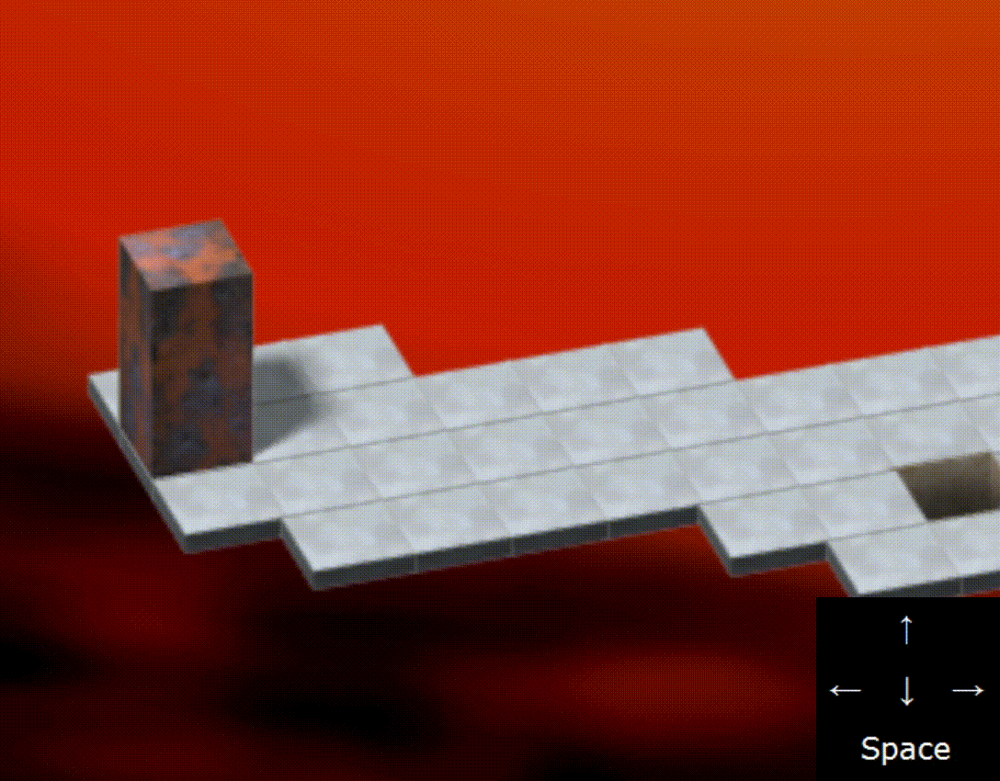
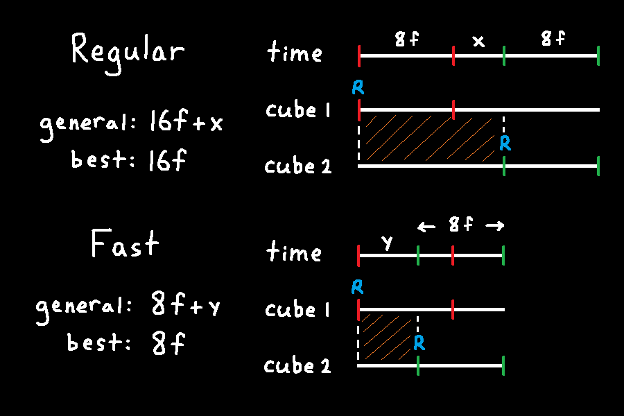

# Bloxorz - Speedrunning Guide and Knowledge Base
_by yujene_

## Table of Contents
- [Introduction](#introduction)
- [Basics](#basics)
- [Advanced Movement](#advanced-movement)
- [Glitches](#glitches)
- [Glitchless Guide](https://github.com/yujene/bloxorzguide/blob/master/glitchless.md)
- [Any% Guide](https://github.com/yujene/bloxorzguide/blob/master/anypercent.md)
- [Closing Words and Credits](#closing-words-and-credits)

----

## Introduction
This document serves as a guide and knowledge base of the mechanics and strats for speedrunning Bloxorz. It will assume that you have a basic understanding of how the game works, but some basics will be included as relevant prerequisite information.

The contents of this document is based on information I've accumulated from running the game and doing experiments. If there's any missing, inaccurate, or unclear information in this document, contact me through discord dm yujene#6345 or the Bloxorz discord linked below.

**Bloxorz New Discord:** https://discord.gg/4yw8MPPJmQ  
**Bloxorz Old Discord:** https://discord.gg/zQQvZ3JmJM  
**Bloxorz Leaderboard:** https://www.speedrun.com/bloxorz

----
## Basics
### Game
Use https://www.coolmathgames.com/0-bloxorz/play so you only have the game in the browser.

### Controls
The block is moved using WASD or the arrow keys. They can be used interchangeably or at the same time.

The space bar toggles between cubes when the block is split. It has no cooldown so you can swap on every frame as long as you have control of the cubes.

### Switches
#### Soft Switch
The soft button can be pressed by any orientation of a block or cube.  
When pressed, the tiles it links to are either enabled, disabled, or toggled.

#### Heavy Switch
The heavy switch can only be pressed by a block in the standing orientation.  
When pressed, the tiles it links to are either enabled, disabled, or toggled.

#### Split Switch
The split switch can only be pressed by a block in the standing orientation.  
When pressed, the block splits into two cubes that are placed into their respective locations.

----
## Advanced Movement
### Movement Timing
The possible movements are **L**eft, **R**ight, **U**p, and **D**own for rolling in the configurations of **W**ide, **L**ong, and **C**ube. The figures below show the roll directions corresponding with the notation for the block. The cube configuration refers to when the block is split into two cubes.

Below is a table of how long it takes for each movement direction-configuration combination. The time is shown in frames, where 1 frame = 1/36 seconds. Frames will always be referring to 36 fps in this guide.

|     | L   | R   | U   | D   |
|-----|----:|----:|----:|----:|
|**W**|    8|    8|    8|    9|
|**L**|    8|    8|    8|    8|
|**C**|    8|    8|    8|    8|

These timings are accurate for when I tested the HTML5 version on the Chrome browser. The HTML5 version on other browsers, or flash version on any browser had movements that were all 1f slower. Each move took 9f and WD took 10f.

The WD movement is a frame slower than the other movements because its animation contains an extra frame.

### Input Buffering
Inputs can be pressed as a block or cube is moving to get the next movement out as soon as possible. The most recent direction input is used, so the previous direction input can continue to be held. For this reason, you can overlap your inputs to ensure direction changes on the next possible frame.

\
As the block, you can buffer space to stop while holding a direction. I don't know of any practical use of this.

### Fast Toggling
Fast toggling is when you input a direction to a cube, swap to second cube, then input a direction to the second cube before the first cube finishes its movement animation. This allows having both cubes moving at the same time, so the time to move 2 cubes is able to be less than double the time to move 1 cube. The time difference between initial direction input and second direction input after toggling can range from 0-8f or 0-222ms. 0ms is the fastest possible fast toggle, and anything after 222ms would be a regular toggle since the block has finished its moving animation.

The comparison below shows the difference between regular toggling and fast toggling respectively. Regular toggling sends an input to the second cube after the first cube's movement animation ends. Fast toggling swaps and sends an input to the second cube before the first cube's movement animation ends.

\
The image below shows the timing difference between regular and fast toggling. The time row labels the time in frames of 36 fps, or indicates a time variable. Inputs are coloured blue. Red and green indicate the start and end of the corresponding cube movement animations. Orange shading indicates the region where the swap input can be done.

The top timeline shows the timing of a regular toggle. Time begins when Right is sent to cube 1. The movement animation takes 8f. The variable x represents how long you wait after the first cube's animation before sending Right to the second cube. The range of x is `x >= 0`, so `x = 0` is the fastest regular toggle. The swap input can occur anywhere between time 0 and x.  
The bottom timeline shows the timing of a fast toggle. The variable y represents how long you wait between Right inputs for each cube. The swap input can occur anywhere between time 0 and y.

### Chained Fast Toggling
Chained fast toggling is just fast toggling but you continue to do it back to back. The movement input you send to the second cube for the initial fast toggle becomes the first input of the next fast toggle. Optimally, you can move both cubes at full speed. The gif below is noticeably suboptimal since the cubes are stopping a lot.

There's a few aspects of optimizing chained fast toggling, so an example in stage 10 will be used.

After splitting in stage 10, you need a block to press the soft switch as early as possible, then join to press the heavy switch. Cube 1 (blue) takes less moves to reach the soft switch, so moving that cube to that switch without stopping is optimal. The earliest you can press the heavy switch is constrained by the cube with the longer path, which is cube 1. This means that cube 2 (red) just needs to arrive at the joining spot before or at the same time as cube 1 to be optimal. This practical case of cube 2 not needing to be as fast as possible to be optimal is relevant in understanding part of optimal chained fast toggling.

Chained fast toggling can be split into the beginning and end, and the repeating stuff in the middle.

The beginning is just a regular fast toggle, where both cubes are initially stationary. Assuming optimal chained fast toggling, the time difference between first and second cube movement inputs, `y`, is also the time difference of when the cubes stop moving at the end. The significance of this time difference at the end is shown by the example of stage 10. If you start chained fast toggling immediately after the split, `y` doesn't matter for an optimal stage time since cube 2 will be waiting for cube 1 anyways. However, in cases where both cubes arrive at the joining spot at the same time, minimizing `y` is fast.

The stuff in the middle is just a repeating sequence of the same thing. The repeating sequence starts from swapping after moving a cube. Now, you have to buffer the direction input so the cube keeps moving as soon as it lands. Once this input is given, you swap as soon as possible, and you're back to the beginning of the repeating sequence, but for the other cube. If you successfully buffer these direction inputs, both cubes will move without stopping, which is the same speed as just holding down a direction for one cube.

Since a move takes 8f, a single iteration of the repeating sequence to move both cubes at the same time is 4 inputs in 8f, or 18 inputs per second optimally. If `y = 4f`, the movement inputs for each cube are equally spaced, and you can press these inputs at a regular rhythm. In the case of stage 10, cube 2 landing 4f later doesn't lose time.

----
## Glitches
### Instance Duplication and Stacking
#### How it works
I'm still not sure exactly how this works in the code, but this is the best explanation I have for what's going on. After splitting the block into two cubes, making them fall off the edge at the same time causes the game to call the respawning code once per instance per cube. On the first time executing instance duplication, you end up with 2 instances because each cube calls the respawn code. On the nth time duplicating, you have two cubes of 2^(n-1) instances calling the respawn code resulting in 2^n instances. I'll be referring to how many times you do instance duplication by "n stacks" or "stacking n times".

The left side of the image below shows why the instances duplicate in powers of two. The right side shows how you would only see one instance after stacking. This means that there's 2^n-1 instances you're also controlling but can't see.

The table below shows the relation between stack number and number of instances.

|Stack Number|Number of Instances|
|----|----|
|0|1|
|1|2|
|2|4|
|3|8|
|4|16|
|5|32|

#### Why is this useful
The significance of instance duplication is that it allows for you to skip levels. When you complete a level with instance duplication, the levelNumber variable gets incremented per instance. This means you can complete a level with n stacks to skip 2^n-1 levels. For [example](https://youtu.be/Yj86HAkrAbU?t=78), completing stage 8 with 1 stack will skip the stage title animation and spawn you straight into stage 10.

#### How to do it
The basic idea is to make both cubes fall off the edge at the same time. This requires doing a non-fast toggle off the edge. This means sending movement input to the first cube, swap, then send movement input to the second cube after the first cube's movement animation has finished. For instance duplication, move the second cube once the first cube is in the falling animation. If you try sending a movement input to the second cube before the first cube's movement animation is finished, you'll see it snap back onto the tile.

The video below sends a movement input to the top cube after 4/30 seconds, so it snaps back on the tile.

The video below sends a movement input to the top cube after 7/30 seconds. I think this is the earliest possible frame if you're checking a 30 fps video.

#### Important note for moving after respawn
Depending on how much you delayed the second cube's movement input, your duplicated set of instances will be desynchronized with your visible set upon respawning. You should be able to hear when both sets have landed. The block is not controllable for about 11 frames after the landing sound, so don't hold any direction until 11 frames after you hear all instances have landed to avoid desynchronizing.

### Menuing
The menuing glitch allows you to set your levelNumber to 1 from any stage. This is accomplished by quitting to menu while in an animation of something that will try to reload the stage. Pressing Quit to Menu sets the levelNumber to 1 and attempts to load into the main menu.

Dying triggers the code that tries to load the level using the levelNumber variable and this overrides the attempt to get to the main menu. When the menuing glitch is done correctly, you load into stage 1 after dying with no stage title cutscene. The video below shows the menuing glitch being used while dying.

Alternatively, you can do the menuing glitch while completing a stage. The difference is that after the levelNumber gets set to 1, it increments by the number of instances that completed the stage, then loads with the new value. In this 33 Level Any% [run](https://youtu.be/iqzBlZVZybw?t=113), you can see 32 instances completing the stage as the menuing glitch is done. Since the levelNumber gets set to 1, you add 32 to load into stage 33.

### Desync Stacking
#### What is this
Desync stacking is executing instance duplication on some of the instances instead of all instances. Normally, all instances are synchronized, so instance duplication doubles the total number of instances. Currently, I only have a setup and practical use for doing desync stacking with half of the instances to multiply the number of instances by 1.5 instead of 2 for normal stacking.

The way to make this work is to desynchronize the position of half of the instances with the other half. Then, you have to do instance duplication on half of the instances while the other half stays on the platform. For the last move of instance duplication on the first half of instances, it shouldn't matter if the other half dies since all of them will respawn together into the same spot.

The image below shows how desync stacking is able to multiply the number of instances by 1.5 instead of 2. The first step is regular instance duplication, so the number of instances double. The next step is desync stacking to multiply the number of instances by 1.5.

#### How to do it
Desync stacking is only possible if you have at least 2 instances because you need two sets of instances to work with. I'll be showing how to desync stack on stage 8.

This is what it looks like to successfully desync stack if you do it with 1 stack. You get warped to stage 11 since 1 stack + 1 desync stack is 3 instances as shown in the image above. Note: the way I complete the stage at the end of the gif is not optimal.

\
Now I'll show each step of what's happening in the video above with an explanation of the inputs and visual of what each instance looks like. The left side will be the visible half of instances, and right side will be the invisible half of instances.

When you do your last stack before doing desync stack, your original instances will spawn at a different time than the duplicated instances. This time difference should be how long you waited before killing the second cube during stacking. As you're respawning, hold right until the visible block has started its movement animation. You should also be able to hear the invisible instance hitting the split tile. If you let go of right at the correct time, the visible block should be lying flat and invisible instances should have the cubes in the default splitting destinations.

\
Before the next step, you have to wait until the invisible cubes are controllable after the split. I have no clue how long you have to wait.

Fast method: After waiting, press left, fast toggle right. The top invisible cube moves left, and the bottom moves right. Since you fast toggled, the visible block only moves left once.

Easier alternative: Press left, space, right without fast toggling. The invisible cubes should do the exact same thing. Only difference is that the visible block will move left, then right. Note: the video below shows how it should look for fast method.

\
Fast method: Press right, space, left not fast toggled. This kills both invisible cubes while the visible block moves and returns to spawn position.

Easier alternative: Press space, left, space, right, left. The first space swaps to control top invisible cube. Left, space, right kills both invisible cubes and leaves the visible block lying flat. The final left input brings the visible block back to spawn position. Note: the fast and easy strats converge after this step, so the image is the same now

It's important that the visible block returns to spawn position so all instances are synchronized once the new duplicated instances spawn.

\
Wait until you hear all instances landing, then solve stage 8 with any strat.

----
## Glitchless Guide
The [Glitchless Guide](https://github.com/yujene/bloxorzguide/blob/master/glitchless.md) is on another page but I put a link here if you didn't use the table of contents.

----
## Any% Guide
The [Any% Guide](https://github.com/yujene/bloxorzguide/blob/master/anypercent.md) is on another page but I put a link here if you didn't use the table of contents.

----
## Closing Words and Credits
Thanks for reading this document. Hopefully it was useful for understanding the tech and/or the strats used in current runs.

Thanks to buhbai's arbguide for the format inspiration.

Thanks to mini weets#3103 for finding a large portion of the glitches.

Thanks to plezbb for getting me too into this game.
